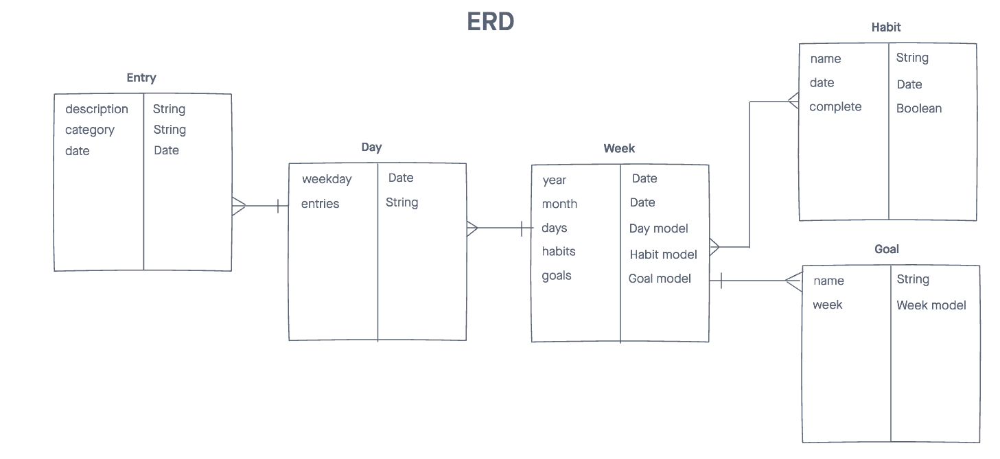

# Planner
A planner application for the user to add daily journal entries, track habits, and have a separate section for goals.

## Technologies Used
* HTML
* CSS
* JavaScript
* NodeJS
* MongoDB
* Mongoose

## Features
* Create a monthly calendar view
* Initialize the new month with previously used habits to track
* Add, edit, or delete monthly goals
* Add, edit, or delete daily journal entries, weekly habits, and weekly goals
* Track daily progress of habits

## Wireframes

## Screenshots

## Future Goals
* Add user authentication
* Allow each user to select color theme
* Color code each journal entry category
* View habit tracker in monthly view
* Make the layout responsive